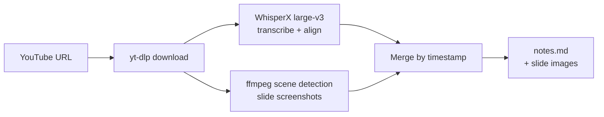

# YouTube Lecture → Markdown Notes Pipeline

Turn a YouTube lecture (slides + talking-head audio, no usable subtitles) into
a single markdown file with slide screenshots and the instructor's discussion
aligned under each one — ready to drop straight into an Obsidian vault.

## Why not just use YouTube's captions or a paid "paste a link" tool?

- **Auto-captions are unreliable on technical content.** Jargon-heavy audio
  (protocol names, acronyms, vendor terms) gets mangled by YouTube's caption
  model far more than by a dedicated speech model.
- **Consumer "paste a link" tools** (ScreenApp, BibiGPT, etc.) work for short
  clips but hit length caps, silent failures on long videos, or output-language
  bugs — and you're trusting a black box for something you'll rely on for study notes.
- **This pipeline** runs open tooling you control, costs cents per video, and
  the whole instance is gone by the time you're reading the output — nothing
  sits around idle billing you.

## How it works



1. **Download** — `yt-dlp` pulls video + audio directly from the YouTube URL (no upload needed).
2. **Transcribe** — WhisperX (large-v3) runs a VAD pre-pass before transcription, which matters
   specifically for lecture-style audio: Whisper is prone to hallucinating repeated phrases during
   long quiet stretches (e.g. a slide sitting on screen while the instructor pauses), and the VAD
   chunking largely eliminates that. The alignment pass also gives word-level timestamps, which
   is what lets the merge step line transcript text up with the right slide.
3. **Extract slides** — instead of screenshotting at fixed intervals (which floods you with
   near-duplicate frames when a slide sits on screen for minutes), `ffmpeg`'s scene-detection
   filter only fires when the visual actually changes.
4. **Merge** — for each slide timestamp, pull every transcript segment that falls between it and
   the next slide, and emit a `## Slide @ mm:ss` heading with the embedded image and the discussion
   underneath.

Everything runs on a single `g4dn.xlarge` **spot** GPU instance that launches, does the work,
uploads results to S3, and **terminates itself** — success or failure — so there's no instance
left idle running up a bill.

## Cost

Roughly **$0.15–$0.40 per 1.5-hour lecture** on spot pricing (us-east-1). WhisperX runs
faster than real-time on a T4, so a 90-minute video is typically 10–20 minutes of actual
GPU time, not 90. The self-terminating instance is the important safety net here — an idle
`g4dn.xlarge` left running costs ~$0.53/hr on-demand for nothing.

---

## One-time setup

You only do this once per AWS account, not per video.

### 1. Configure the AWS CLI
```bash
aws configure
```
Use `us-east-1` as the default region — it's consistently one of the cheapest for `g4dn` instances.

### 2. Create an S3 bucket for job files
```bash
aws s3 mb s3://your-unique-bucket-name --region us-east-1
```

### 3. Create the IAM role and instance profile

Save this as `iam-policy.json` first (replace `your-bucket-name`):

```json
{
  "Version": "2012-10-17",
  "Statement": [
    {
      "Sid": "S3JobBucketAccess",
      "Effect": "Allow",
      "Action": ["s3:GetObject", "s3:PutObject", "s3:ListBucket"],
      "Resource": [
        "arn:aws:s3:::your-bucket-name",
        "arn:aws:s3:::your-bucket-name/*"
      ]
    },
    {
      "Sid": "SelfTerminateOnly",
      "Effect": "Allow",
      "Action": "ec2:TerminateInstances",
      "Resource": "*",
      "Condition": {
        "StringLike": {
          "ec2:ResourceTag/Name": "whisperx-*"
        }
      }
    }
  ]
}
```

Then:
```bash
aws iam create-role --role-name whisperx-pipeline-role \
  --assume-role-policy-document '{
    "Version": "2012-10-17",
    "Statement": [{
      "Effect": "Allow",
      "Principal": {"Service": "ec2.amazonaws.com"},
      "Action": "sts:AssumeRole"
    }]
  }'

aws iam put-role-policy --role-name whisperx-pipeline-role \
  --policy-name whisperx-pipeline-policy \
  --policy-document file://iam-policy.json

aws iam create-instance-profile --instance-profile-name whisperx-pipeline-role
aws iam add-role-to-instance-profile \
  --instance-profile-name whisperx-pipeline-role \
  --role-name whisperx-pipeline-role
```
Give it ~10 seconds to propagate before using it.

### 4. Create an outbound-only security group
```bash
VPC_ID=$(aws ec2 describe-vpcs --filters Name=isDefault,Values=true --query 'Vpcs[0].VpcId' --output text)

aws ec2 create-security-group \
  --group-name whisperx-pipeline-sg \
  --description "Outbound-only SG for WhisperX pipeline instances" \
  --vpc-id "$VPC_ID"
```
No inbound rules needed — the instance only needs outbound access to YouTube, PyPI, and S3.

### 5. Fill in the config block at the top of `launch_job.sh`
```bash
S3_BUCKET="your-unique-bucket-name"
REGION="us-east-1"
KEY_NAME=""                          # optional, leave blank if you don't need SSH debugging
SECURITY_GROUP="sg-xxxxxxxxxxxxxxxxx"
IAM_INSTANCE_PROFILE="whisperx-pipeline-role"
```

```bash
chmod +x launch_job.sh bootstrap.sh
```

---

## Running a job

```bash
./launch_job.sh "https://www.youtube.com/watch?v=XXXXXXXX"
```

What happens, in order:
1. `pipeline.py` uploads to `s3://your-bucket/jobs/<job-id>/`
2. Script resolves the latest AWS Deep Learning AMI (GPU + PyTorch + Ubuntu 22.04)
3. A `g4dn.xlarge` spot instance launches with the YouTube URL baked into its user-data
4. On boot: installs deps → downloads video → transcribes → extracts slides → merges to `notes.md` → uploads to S3 → **terminates itself**
5. `launch_job.sh` polls S3 and pulls the output down automatically once it's ready

Result:
```
./output-job-<timestamp>/
  notes.md          ← drop this + slides/ into your Obsidian vault
  slides/
    slide_001.png
    slide_002.png ...
  transcript.json   ← raw WhisperX segments, for re-merging later
  slides.json        ← raw slide timestamps
```

`notes.md` uses Obsidian's `![[filename]]` embed syntax, so copying the whole output
folder into a vault resolves the images automatically.

### Re-running just the merge

If you want to regroup slides or adjust logic without re-transcribing:
```bash
python3 merge_to_markdown.py \
  --transcript ./output-job-xxx/transcript.json \
  --slides ./output-job-xxx/slides.json \
  --title "Lecture title" \
  --output notes.md
```

---

## Confirming the instance actually terminated

```bash
aws ec2 describe-instances \
  --filters "Name=tag:Name,Values=whisperx-*" "Name=instance-state-name,Values=running,pending" \
  --region us-east-1 \
  --query 'Reservations[].Instances[].[InstanceId,State.Name]' \
  --output table
```
Should return an empty table a few minutes after the job finishes. `bootstrap.sh` uses a
`trap` on `EXIT` so termination fires whether the job succeeds or crashes partway — but
checking this the first few times is good practice before you trust it blindly.

Check spend:
```bash
aws ce get-cost-and-usage \
  --time-period Start=$(date -u -d '1 day ago' +%Y-%m-%d),End=$(date -u +%Y-%m-%d) \
  --granularity DAILY --metrics "UnblendedCost" \
  --filter '{"Dimensions":{"Key":"SERVICE","Values":["Amazon Elastic Compute Cloud - Compute"]}}'
```

---

## Tuning

- **Scene-detection sensitivity**: default threshold is `0.12` in `pipeline.py`. Raise it
  (e.g. `0.2`) if you're getting near-duplicate slides; lower it (e.g. `0.08`) if subtle
  animations/builds aren't being caught.
- **Spot interruption**: rare on `g4dn` given T4 availability, and since this is a batch job,
  an interruption just means rerunning `launch_job.sh` with the same URL.

---

## Scripts

<details>
<summary><code>pipeline.py</code> — runs on the EC2 instance</summary>

```python
#!/usr/bin/env python3
"""
YouTube lecture -> transcript + slide screenshots -> markdown notes.
Runs on the EC2 GPU instance. Not meant to run on your laptop (needs CUDA for WhisperX).
"""
import argparse
import json
import re
import subprocess
from pathlib import Path


def download_video(youtube_url: str, workdir: Path):
    video_path = workdir / "source.mp4"
    audio_path = workdir / "audio.wav"

    print(f"[1/4] Downloading: {youtube_url}")
    subprocess.run(
        [
            "yt-dlp",
            "-f", "bestvideo[height<=1080]+bestaudio/best",
            "--merge-output-format", "mp4",
            "-o", str(video_path),
            youtube_url,
        ],
        check=True,
    )

    subprocess.run(
        ["ffmpeg", "-y", "-i", str(video_path), "-ar", "16000", "-ac", "1", str(audio_path)],
        check=True,
    )
    return video_path, audio_path


def transcribe(audio_path: Path, workdir: Path):
    import whisperx

    print("[2/4] Transcribing with WhisperX (large-v3)...")
    device = "cuda"
    model = whisperx.load_model("large-v3", device, compute_type="float16")
    audio = whisperx.load_audio(str(audio_path))
    result = model.transcribe(audio, batch_size=16)

    align_model, metadata = whisperx.load_align_model(language_code=result["language"], device=device)
    result = whisperx.align(result["segments"], align_model, metadata, audio, device)

    segments = result["segments"]
    with open(workdir / "transcript.json", "w") as f:
        json.dump(segments, f, indent=2)
    return segments


def extract_slides(video_path: Path, workdir: Path, threshold: float = 0.12):
    print(f"[3/4] Extracting slide screenshots (scene threshold={threshold})...")
    slides_dir = workdir / "slides"
    slides_dir.mkdir(exist_ok=True)

    cmd = [
        "ffmpeg", "-i", str(video_path),
        "-vf", f"select='gt(scene,{threshold})',showinfo",
        "-vsync", "vfr",
        str(slides_dir / "slide_%03d.png"),
    ]
    proc = subprocess.run(cmd, capture_output=True, text=True)

    timestamps = []
    for line in proc.stderr.splitlines():
        m = re.search(r"pts_time:([0-9.]+)", line)
        if m:
            timestamps.append(float(m.group(1)))

    if not timestamps or timestamps[0] > 1.0:
        timestamps.insert(0, 0.0)

    slide_files = sorted(slides_dir.glob("slide_*.png"))
    slides = list(zip(slide_files, timestamps))

    with open(workdir / "slides.json", "w") as f:
        json.dump([{"file": s[0].name, "timestamp": s[1]} for s in slides], f, indent=2)

    return slides


def build_markdown(segments, slides, workdir: Path, title: str):
    print("[4/4] Building markdown notes...")
    lines = [f"# {title}", ""]

    if not slides:
        lines.append("_No slide changes detected — try lowering --scene-threshold and rerun._")
        lines.append("")

    for i, (slide_file, ts) in enumerate(slides):
        next_ts = slides[i + 1][1] if i + 1 < len(slides) else float("inf")
        mins, secs = divmod(int(ts), 60)
        lines.append(f"## Slide @ {mins:02d}:{secs:02d}")
        lines.append("")
        lines.append(f"![[{slide_file.name}]]")
        lines.append("")

        chunk_text = " ".join(
            seg["text"].strip() for seg in segments if ts <= seg["start"] < next_ts
        ).strip()

        if chunk_text:
            lines.append(f"> {chunk_text}")
        else:
            lines.append("> _(no speech detected in this window)_")
        lines.append("")

    md_path = workdir / "notes.md"
    md_path.write_text("\n".join(lines))
    print(f"Wrote {md_path}")
    return md_path


def main():
    parser = argparse.ArgumentParser()
    parser.add_argument("--youtube-url", required=True)
    parser.add_argument("--output-dir", required=True)
    parser.add_argument("--job-id", required=True)
    parser.add_argument("--scene-threshold", type=float, default=0.12,
                         help="Lower = more sensitive to subtle slide transitions/animations")
    args = parser.parse_args()

    workdir = Path(args.output_dir)
    workdir.mkdir(parents=True, exist_ok=True)

    video_path, audio_path = download_video(args.youtube_url, workdir)
    segments = transcribe(audio_path, workdir)
    slides = extract_slides(video_path, workdir, args.scene_threshold)
    build_markdown(segments, slides, workdir, args.job_id)

    print("Done.")


if __name__ == "__main__":
    main()
```
</details>

<details>
<summary><code>merge_to_markdown.py</code> — standalone re-merge, runs anywhere</summary>

```python
#!/usr/bin/env python3
"""
Standalone merge: WhisperX transcript.json + slides.json (+ slide images)
-> single Obsidian-style markdown file.

Use this on its own if you already have transcript.json and slides.json
and just want to regenerate notes.md — no GPU or re-transcription needed.

Usage:
    python3 merge_to_markdown.py \
        --transcript transcript.json \
        --slides slides.json \
        --title "Network Design Lecture 3" \
        --output notes.md
"""
import argparse
import json
from pathlib import Path


def load_json(path: Path):
    with open(path) as f:
        return json.load(f)


def build_markdown(segments, slides, title: str) -> str:
    lines = [f"# {title}", ""]

    if not slides:
        lines.append("_No slides found — check slides.json._")
        return "\n".join(lines)

    for i, slide in enumerate(slides):
        ts = slide["timestamp"]
        next_ts = slides[i + 1]["timestamp"] if i + 1 < len(slides) else float("inf")

        mins, secs = divmod(int(ts), 60)
        lines.append(f"## Slide @ {mins:02d}:{secs:02d}")
        lines.append("")
        lines.append(f"![[{slide['file']}]]")
        lines.append("")

        chunk_text = " ".join(
            seg["text"].strip() for seg in segments if ts <= seg["start"] < next_ts
        ).strip()

        lines.append(f"> {chunk_text}" if chunk_text else "> _(no speech detected in this window)_")
        lines.append("")

    return "\n".join(lines)


def main():
    parser = argparse.ArgumentParser()
    parser.add_argument("--transcript", required=True, help="Path to transcript.json (WhisperX segments)")
    parser.add_argument("--slides", required=True, help="Path to slides.json ([{file, timestamp}, ...])")
    parser.add_argument("--title", required=True, help="Title / heading for the notes file")
    parser.add_argument("--output", default="notes.md")
    args = parser.parse_args()

    segments = load_json(Path(args.transcript))
    slides = load_json(Path(args.slides))

    markdown = build_markdown(segments, slides, args.title)
    Path(args.output).write_text(markdown)
    print(f"Wrote {args.output} ({len(slides)} slides, {len(segments)} transcript segments)")


if __name__ == "__main__":
    main()
```
</details>

<details>
<summary><code>bootstrap.sh</code> — EC2 user-data, installs deps and self-terminates</summary>

```bash
#!/bin/bash
# This runs as root via EC2 user-data on instance boot.
# Placeholders (__YOUTUBE_URL__, __S3_BUCKET__, __JOB_ID__, __REGION__) are
# substituted by launch_job.sh before the instance is launched.
set -uxo pipefail
exec > /var/log/pipeline-bootstrap.log 2>&1

YOUTUBE_URL="__YOUTUBE_URL__"
S3_BUCKET="__S3_BUCKET__"
JOB_ID="__JOB_ID__"
REGION="__REGION__"

# No matter what happens below (success or failure), always terminate —
# this is the guardrail that stops a bug from turning into a runaway bill.
terminate_self() {
  TOKEN=$(curl -s -X PUT "http://169.254.169.254/latest/api/token" -H "X-aws-ec2-metadata-token-ttl-seconds: 60")
  INSTANCE_ID=$(curl -s -H "X-aws-ec2-metadata-token: ${TOKEN}" http://169.254.169.254/latest/meta-data/instance-id)
  aws ec2 terminate-instances --instance-ids "${INSTANCE_ID}" --region "${REGION}"
}
trap terminate_self EXIT

apt-get update -y
apt-get install -y ffmpeg python3-pip python3-venv

python3 -m venv /opt/pipeline-venv
source /opt/pipeline-venv/bin/activate

pip install --upgrade pip
pip install torch torchaudio --index-url https://download.pytorch.org/whl/cu121
pip install whisperx yt-dlp boto3

mkdir -p /opt/job
cd /opt/job

aws s3 cp "s3://${S3_BUCKET}/jobs/${JOB_ID}/pipeline.py" ./pipeline.py --region "${REGION}"

python3 pipeline.py \
  --youtube-url "${YOUTUBE_URL}" \
  --output-dir /opt/job/output \
  --job-id "${JOB_ID}"

PIPELINE_EXIT=$?

if [ "${PIPELINE_EXIT}" -eq 0 ]; then
  aws s3 cp /opt/job/output "s3://${S3_BUCKET}/jobs/${JOB_ID}/output/" --recursive --region "${REGION}"
  echo "done" | aws s3 cp - "s3://${S3_BUCKET}/jobs/${JOB_ID}/STATUS" --region "${REGION}"
else
  echo "failed" | aws s3 cp - "s3://${S3_BUCKET}/jobs/${JOB_ID}/STATUS" --region "${REGION}"
  aws s3 cp /var/log/pipeline-bootstrap.log "s3://${S3_BUCKET}/jobs/${JOB_ID}/bootstrap.log" --region "${REGION}" || true
fi
# terminate_self runs automatically via the EXIT trap set above
```
</details>

<details>
<summary><code>launch_job.sh</code> — run this on your own machine</summary>

```bash
#!/bin/bash
# Usage: ./launch_job.sh "https://www.youtube.com/watch?v=XXXXXXXX"
#
# Run this on YOUR machine, not on AWS. Requires AWS CLI configured
# (aws configure) with permissions to launch EC2 spot instances and
# read/write the S3 bucket below.
set -euo pipefail

if [ $# -ne 1 ]; then
  echo "Usage: $0 <youtube-url>"
  exit 1
fi

YOUTUBE_URL="$1"

# ---- EDIT THESE ONE-TIME SETTINGS ----
S3_BUCKET="your-bucket-name"
REGION="us-east-1"
KEY_NAME="your-keypair-name"          # optional, only needed for SSH debugging
SECURITY_GROUP="sg-xxxxxxxxxxxxxxxxx"
IAM_INSTANCE_PROFILE="whisperx-pipeline-role"
# ---------------------------------------

JOB_ID="job-$(date +%s)"
SCRIPT_DIR="$(cd "$(dirname "${BASH_SOURCE[0]}")" && pwd)"

echo "Job ID: ${JOB_ID}"
echo "Uploading pipeline.py to S3..."
aws s3 cp "${SCRIPT_DIR}/pipeline.py" "s3://${S3_BUCKET}/jobs/${JOB_ID}/pipeline.py" --region "${REGION}"

echo "Looking up latest Deep Learning AMI (GPU, PyTorch, Ubuntu 22.04)..."
AMI_ID=$(aws ec2 describe-images \
  --owners amazon \
  --filters "Name=name,Values=Deep Learning AMI GPU PyTorch*(Ubuntu 22.04)*" \
  --query 'sort_by(Images, &CreationDate)[-1].ImageId' \
  --output text --region "${REGION}")

if [ "${AMI_ID}" == "None" ] || [ -z "${AMI_ID}" ]; then
  echo "Could not find a Deep Learning AMI in ${REGION}. Check the filter or region."
  exit 1
fi
echo "Using AMI: ${AMI_ID}"

BOOTSTRAP_TMP="$(mktemp)"
sed -e "s|__YOUTUBE_URL__|${YOUTUBE_URL}|g" \
    -e "s|__S3_BUCKET__|${S3_BUCKET}|g" \
    -e "s|__JOB_ID__|${JOB_ID}|g" \
    -e "s|__REGION__|${REGION}|g" \
    "${SCRIPT_DIR}/bootstrap.sh" > "${BOOTSTRAP_TMP}"

echo "Launching spot instance..."
aws ec2 run-instances \
  --region "${REGION}" \
  --image-id "${AMI_ID}" \
  --instance-type g4dn.xlarge \
  --key-name "${KEY_NAME}" \
  --security-group-ids "${SECURITY_GROUP}" \
  --iam-instance-profile "Name=${IAM_INSTANCE_PROFILE}" \
  --instance-market-options '{"MarketType":"spot","SpotOptions":{"SpotInstanceType":"one-time","InstanceInterruptionBehavior":"terminate"}}' \
  --block-device-mappings '[{"DeviceName":"/dev/sda1","Ebs":{"VolumeSize":60,"VolumeType":"gp3"}}]' \
  --user-data "file://${BOOTSTRAP_TMP}" \
  --tag-specifications "ResourceType=instance,Tags=[{Key=Name,Value=whisperx-${JOB_ID}}]" \
  --output text --query 'Instances[0].InstanceId'

echo ""
echo "Instance launching. This takes ~10-20 min end to end for a 1.5hr video."
echo "Polling s3://${S3_BUCKET}/jobs/${JOB_ID}/STATUS ..."
echo ""

while true; do
  STATUS=$(aws s3 cp "s3://${S3_BUCKET}/jobs/${JOB_ID}/STATUS" - --region "${REGION}" 2>/dev/null || echo "")
  if [ "${STATUS}" == "done" ]; then
    echo "Done! Downloading output..."
    mkdir -p "./output-${JOB_ID}"
    aws s3 cp "s3://${S3_BUCKET}/jobs/${JOB_ID}/output/" "./output-${JOB_ID}/" --recursive --region "${REGION}"
    echo "Notes are in ./output-${JOB_ID}/notes.md — copy the folder into your Obsidian vault."
    break
  elif [ "${STATUS}" == "failed" ]; then
    echo "Pipeline failed. Fetching bootstrap.log for debugging..."
    aws s3 cp "s3://${S3_BUCKET}/jobs/${JOB_ID}/bootstrap.log" "./bootstrap-${JOB_ID}.log" --region "${REGION}" || true
    echo "See ./bootstrap-${JOB_ID}.log"
    exit 1
  fi
  sleep 20
done
```
</details>

---

*Originally built for CyberStorm SOC practice-track use — same self-terminating
ephemeral-instance pattern as the range infra, applied to a different problem.*
